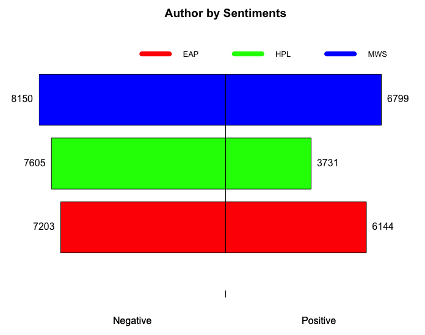

# Spring 2018
# Project 1: Spooky Data Analysis

## Project Description
This is the first and only *individual* (as opposed to *team*) this semester. 

+ Projec title: Who wrote these spooky texts?

+ This project is conducted by Ginny Gao, Columbia UNI: qg2158

+ Project summary: This project studies writing styles from 3 popular horror authors (1800s to early 1900s): [Edgar Allan Poe (EAP)](https://en.wikipedia.org/wiki/Edgar_Allan_Poe), [HP Lovecraft (HPL)](https://en.wikipedia.org/wiki/H._P._Lovecraft), and [Mary Wollstonecraft Shelley (MWS)](https://en.wikipedia.org/wiki/Mary_Shelley). It compares and contrasts positive and negative emotions in their writing content via sentiment analysis, and also identifies words frequently appear together in the authors' excerpts through topic modeling.

## 1. Who write how many texts in the dataset?

Pie chart shows composition of author's texts in the dataset.

It appears that most texts belong to EAP (40.3%), followed by MWS (30.9%) and HPL (28.8%).

## 2. Do some authors use more questions in the texts than others?

Waffle chart presents the comparison of use of questions in texts among 3 authors.

Not suprisingly, EAP uses most number of questions in his texts, as EAP has more texts than others in the dataset. Notice MWS and HPL have approximately same number of texts in the dataset from study above (#1-who-write-how-many-texts-in-the-dataset), but MWS uses more than twice as many questions in her texts than HPL does. This can be a key identifier to differentiate MWS and HPL's texts.

## 3. How do sentiments compare in these authors' writings?

Pyramid chart displays positive and negative emotional content in different authors' texts.

[bing lexicon](https://www.cs.uic.edu/~liub/FBS/sentiment-analysis.html) is applied in this sentiment analysis.

From the pyramid chart, we can see that all 3 authors use words with negative emotions in their texts more than positive ones. After all, they are horror authors! While MWS leads the total number of emotional words in her texts compare to the other 2 authors, her negative to positive words ratio is about the same as EAP's. HPL, on the other hand, uses twice as many negative words than positive words in his writings.

